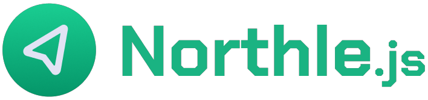

<div align="center">
  

  <h1>Northle Contributing Guide</h1>

  <p align="center">A short instruction guide for contributing to NorthleJS framework repositories.</p>

  <h4>
    <a href="../README.md">Documentation</a>
    <span> · </span>
    <a href="CONTRIBUTING.md">Contributing</a>
  </h4>
</div>

<!-- omit in toc -->
### 📓 Table of Contents

- [Creating Pull Requests](#creating-pull-requests)
- [Development Setup](#development-setup)
  - [Core package](#core-package)
  - [Project Template](#project-template)

## Creating Pull Requests

Contributing in this repository is based on GitHub's [Pull Requests](https://docs.github.com/en/pull-requests/collaborating-with-pull-requests/proposing-changes-to-your-work-with-pull-requests/about-pull-requests). Before creating a pull request, please read through the following rules:

- Always provide a short description to your pull request. You can also open an [Issue](https://docs.github.com/en/issues/tracking-your-work-with-issues/about-issues) before working on it.
- Commit messages must follow a specific convention - they must be short and first letter must be uppercased, for example: `git commit -m "Added feature x"`.

## Development Setup

### Core package

First, clone the `@northle/core` package repository and install its dependencies:

```shell
$ git clone https://github.com/northle/core.git

$ cd core
$ npm install
$ npm run build
$ npm link
```

Then, change the import path in the `src/database` directory: `PrismaClient` and `User` should be imported from `../../../northle/node_modules/@prisma/client` in development mode. Don't forget to change it back before creating a [Pull Request](https://docs.github.com/en/pull-requests/collaborating-with-pull-requests/proposing-changes-to-your-work-with-pull-requests/about-pull-requests)!

### Project Template

Next, clone project template repository (in the parent folder of the `core` repository):

```shell
$ git clone https://github.com/northle/project-template.git

$ cd northle
$ cp .env.example .env
$ npm install
$ npm link @northle/core
```

Then, set the `DEVELOPER_MODE` variable in `.env` file to `true`.

To compile TypeScript code, run `npm run build:watch` command.

After all these steps, run `npm start` in the `northle` directory. Your app will be available on `http://localhost:8000` by default. You can change the port in `.env` file.

*Remember that after every dependency addition / removal you need to run `npm link` again.*
