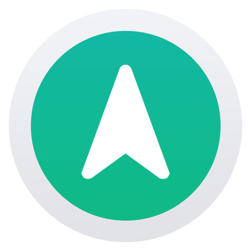

<div align="center">
  

  <h1>Norther Contributing Guide</h1>

  <p align="center">A short instruction guide for contributing to NortherJS framework repositories.</p>

  <h4>
    <a href="README.md">Documentation</a>
    <span> · </span>
    <a href="CONTRIBUTING.md">Contributing</a>
  </h4>
</div>

<!-- omit in toc -->
### 📓 Table of Contents

- [Creating Pull Requests](#creating-pull-requests)
- [Development Setup](#development-setup)
  - [Core package](#core-package)
  - [Project Directory](#project-directory)

## Creating Pull Requests

Contributing in this repository is based in GitHub's Pull Requests. Before creating a pull request, please read through the following rules:

- Always provide a short description to your pull request. You can also open an issue before working on it.
- Commit messages must follow a specific convention - they must be short and first letter must be uppercased, for example: `git commit -m "Added feature x"`.

## Development Setup

### Core package

First, clone the `@norther/core` package repository and install its dependencies:

```shell
$ git clone https://github.com/northerjs/core.git

$ cd core
$ npm install
$ npm run build
$ npm link
```

### Project Directory

Next, you have to clone app project repository (in the parent folder oof the `core` repo):

```shell
$ git clone https://github.com/northerjs/norther.git

$ cd norther
$ cp .env.example .env
$ npm install
$ npm link @norther/core
```

Then, to compile TypeScript code, run `npm run build:watch` command.

For testing database client, you have to change the import path in the `src/database/database-client.class.ts` `@norther/core` package file: `PrismaClient` should be imported from `../../../norther/node_modules/@prisma/client` in developmnet mode. Don't forget to change it back before creating a pull request!

After all these steps, run `npm start` in the `norther` directory. Your app will be available on `http://localhost:8000` by default. You can change the port in `.env` file.
